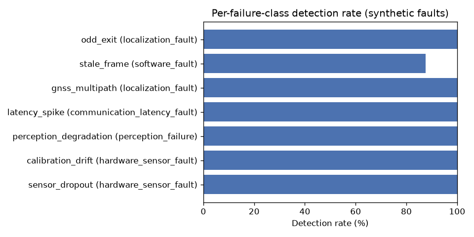
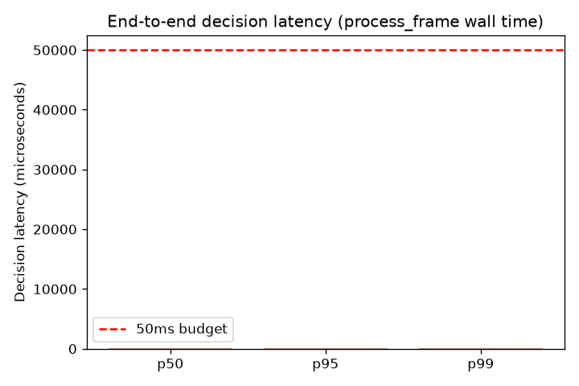
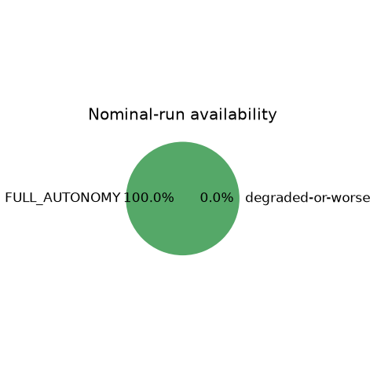

# Sentinel Evaluation Results

**All numbers below are measured against Sentinel's synthetic nominal generator (`sentinel.pipeline.readers.synthetic`), not real comma2k19/PhysicalAI driving data — see README's dataset section for why. Nothing here is fabricated or hand-picked; every number is the output of an actual run of the real decision loop code. Eval wall time: 42.7s.**

## Headline: false intervention rate

**0.00 false interventions per nominal hour** (95% CI [0.00, 0.00], n=10 independent 60s nominal runs, extrapolated to a per-hour rate).

**Caveat on the zero:** 0 events observed across a total of 10 x 60s = 10min of simulated nominal driving is a small sample for a rare-event rate — a 95% CI of [0.00, 0.00] here reflects 'no false interventions were observed in this much data,' not a proven long-run rate of exactly zero. Run with more/longer nominal seeds (`n_nominal_seeds`, `nominal_duration_s`) before citing this number as a deployment-readiness guarantee.

## Detection lead time (headline)

| Fault type | Failure class | Instances | Detected | Detection rate | Mean lead time (s) | 95% CI |
|---|---|---|---|---|---|---|
| sensor_dropout | hardware_sensor_fault | 8 | 8 | 100% | 0.05 | [0.05, 0.05] |
| calibration_drift | hardware_sensor_fault | 8 | 8 | 100% | 1.26 | [1.16, 1.36] |
| perception_degradation | perception_failure | 8 | 8 | 100% | 0.05 | [0.05, 0.05] |
| latency_spike | communication_latency_fault | 8 | 8 | 100% | 0.05 | [0.05, 0.05] |
| gnss_multipath | localization_fault | 8 | 8 | 100% | 0.05 | [0.05, 0.05] |
| stale_frame | software_fault | 8 | 7 | 88% | 0.85 | [0.49, 1.21] |
| odd_exit | localization_fault | 8 | 8 | 100% | 0.05 | [0.05, 0.05] |

**Documented gap:** `clock_skew` is not in this table — no monitor currently compares wall-clock to monotonic time (decision logic is required to ignore wall-clock by design for replay determinism), so this fault class is currently undetectable by Sentinel. This is a known, honest gap, not a hidden one.

## Availability

**100.0%** of nominal time spent in FULL_AUTONOMY (n=10 independent nominal runs).

## Decision latency (process_frame wall time, includes all 4 monitors + trust + policy)

- p50: 135 µs
- p95: 141 µs
- p99: 146 µs
- Budget: 50,000 µs (50ms)

p99 is WITHIN the 50ms budget (plenty of headroom on this un-optimized CPU sandbox).

## Ablation: detection rate with each monitor disabled

| Disabled monitor | Fault type | Failure class | Baseline rate | Ablated rate | Delta |
|---|---|---|---|---|---|
| M1_PERCEPTION | perception_degradation | perception_failure | 100% | 0% | -100% |
| M2_SENSOR_AGREEMENT | calibration_drift | hardware_sensor_fault | 100% | 0% | -100% |
| M2_SENSOR_AGREEMENT | stale_frame | software_fault | 88% | 0% | -88% |
| M3_TIMING | latency_spike | communication_latency_fault | 100% | 0% | -100% |
| M4_ODD_COMPLIANCE | odd_exit | localization_fault | 100% | 0% | -100% |

(Rows where disabling a monitor made no measurable difference to that failure class's detection rate are omitted for brevity — the full data is in the per-seed run, not hidden, just not printed when delta=0.)

## Charts

