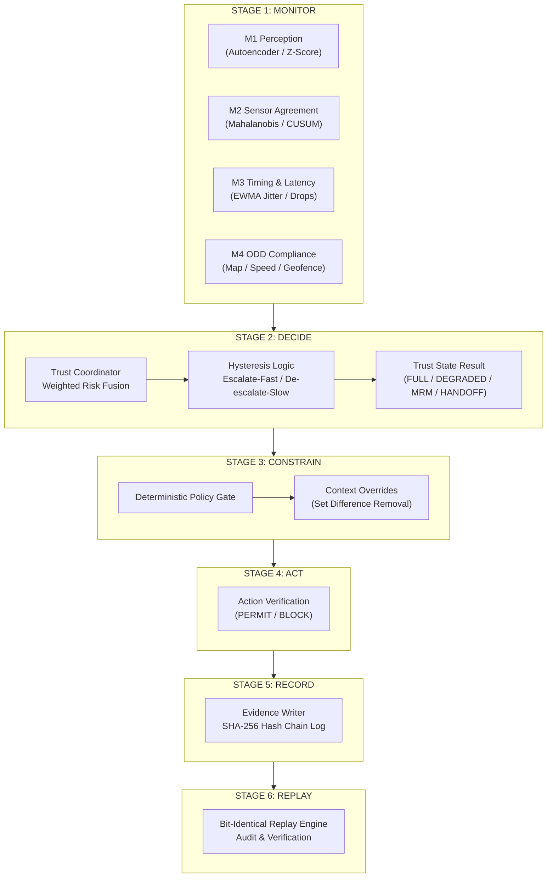

# SYSTEM ARCHITECTURE SPECIFICATION
## Sentinel: Deterministic Out-of-Band Runtime Assurance Layer for Autonomous Systems

```
Doc Status     : APPROVED FOR ARCHITECTURAL PRESENTATION
Target Platform: NVIDIA Grace Blackwell GB10 (128GB LPDDR5x Unified Memory)
Execution Engine: Uvicorn / FastAPI / Async Python 3.12 / C++ Core Wrappers
Primary Standard: ISO 26262 ASIL-D / ISO 21448 SOTIF Out-of-Band Assurance Paradigm
```

---

## 1. EXECUTIVE SUMMARY & DESIGN PHILOSOPHY

**Sentinel** is an out-of-band runtime safety enforcement system designed for high-autonomy Level 4/5 physical AI platforms. Traditional autonomous driving (AV) stacks embed safety logic directly within the perception-planning-control pipeline. Sentinel breaks this paradigm by operating **completely external to the autonomy stack**.

```
+-----------------------------------------------------------------------------------+
|                              AUTONOMY STACK (Black Box)                           |
|  [Sensors] ---> [Perception & World Model] ---> [Planner & LLM] ---> [Actuators]  |
+--------------------------------------------------|--------------------------------+
                                                   | Candidate Trajectory / Action
                                                   v
+-----------------------------------------------------------------------------------+
|                         SENTINEL RUNTIME ASSURANCE LAYER                          |
|                                                                                   |
|   +-------------------+    +--------------------+    +------------------------+   |
|   | 4x Monitor Bank   | -> | Trust Coordinator  | -> | Deterministic Policy   |   |
|   | (M1, M2, M3, M4)  |    | (Risk Fusion)      |    | Gate (Monotonicity)   |   |
|   +-------------------+    +--------------------+    +------------------------+   |
|                                                                  |                |
+------------------------------------------------------------------|----------------+
                                                                   v
                                                     [ PERMIT / BLOCK / HANDOFF ]
```

### Core Axioms:
1. **No AI/LLM is Ever a Safety Authority**: AI models (including Vision-Language Models and learned perception autoencoders) produce *typed evidence*, not policy decisions.
2. **Monotonicity of Evidence**: External evidence and LLM outputs can **only tighten** system authority (restrict speed, disallow overtake, force degrade), **never expand it**. This property is enforced structurally by set-difference logic in code and proven via property-based verification.
3. **Decoupled Authority Control**: Sentinel does not calculate vehicle steering or acceleration commands. It continuously calculates the **maximum allowable authority state** (`FULL_AUTONOMY`, `DEGRADED`, `MINIMAL_RISK_MANEUVER`, `HANDOFF_TO_HUMAN`).
4. **Deterministic Bit-Identical Replayability**: All evidence objects, monitor scores, and trust state transitions carry cryptographic digests. Any live run can be bit-for-bit replayed offline for regulatory auditing (ISO 26262 / NHTSA compliance).

---

## 2. SYSTEM ARCHITECTURE & 6-STAGE EXECUTION LOOP

Sentinel operates on a synchronized **20 Hz (50ms budget)** execution loop:

$$\text{Monitor} \longrightarrow \text{Decide} \longrightarrow \text{Constrain} \longrightarrow \text{Act} \longrightarrow \text{Record} \longrightarrow \text{Replay}$$



---

## 3. PARALLEL MONITOR BANK & ANOMALY DETECTION (M1 - M4)

The monitor bank runs 4 independent safety evaluators in parallel every 50ms:

```
+-----------------------------------------------------------------------------------+
|                          PARALLEL MONITOR BANK MATRIX                             |
+-------------------+-------------------+--------------------+---------------------+
| Monitor ID        | Anomaly Metric    | Mathematical Form  | Detection Target    |
+-------------------+-------------------+--------------------+---------------------+
| M1_PERCEPTION     | Reconstruction /  | GRU Autoencoder /  | Bounding box jitter,|
|                   | Rolling Z-Score   | Z = (x - mu)/sigma | class flips, churn  |
+-------------------+-------------------+--------------------+---------------------+
| M2_SENSOR_AGREE   | Residual Drift /  | Mahalanobis D_M /  | IMU-GNSS drift,     |
|                   | CUSUM Anomaly     | CUSUM S_k          | calibration slip    |
+-------------------+-------------------+--------------------+---------------------+
| M3_TIMING         | Inter-arrival     | EWMA Jitter /      | Thread starvation,  |
|                   | EWMA Jitter       | Deadline Check     | dropped frames      |
+-------------------+-------------------+--------------------+---------------------+
| M4_ODD_COMPLIANCE | Boundary & Speed  | Geofence Polygon / | Speed limit exit,   |
|                   | Violation         | Map Match (GIS)    | construction zone   |
+-------------------+-------------------+--------------------+---------------------+
```

### Mathematical Specifications:

1. **M1 Perception Monitor**:
   Calculates rolling z-scores across feature vectors $\mathbf{x} = [c_{\text{mean}}, N_{\text{churn}}, N_{\text{flips}}, \sigma_{\text{jitter}}]$ against a frozen nominal baseline buffer $\mathcal{B}$:
   $$Z_{\text{max}} = \max_{i} \left| \frac{x_i - \mu_i}{\sigma_i} \right|$$
   - $Z_{\text{max}} \ge 3.073 \implies \text{WARN}$
   - $Z_{\text{max}} \ge 4.588 \implies \text{FAIL}$

2. **M2 Sensor Agreement Monitor**:
   Computes Mahalanobis distance between CAN speed + IMU acceleration and GNSS position deltas:
   $$D_M(\mathbf{x}) = \sqrt{(\mathbf{x} - \boldsymbol{\mu})^T \mathbf{\Sigma}^{-1} (\mathbf{x} - \boldsymbol{\mu})}$$
   Accumulated residual drift is tracked via upper CUSUM statistic:
   $$S_k = \max(0, S_{k-1} + (D_M - k_{\text{drift}}))$$

3. **M3 Timing Monitor**:
   Monitors tick arrival intervals $\Delta t$ against expected period $T = 50\text{ ms}$:
   $$J_k = \alpha \cdot |\Delta t - T| + (1 - \alpha) \cdot J_{k-1}$$
   Triggers $\text{FAIL}$ if consecutive dropped ticks $\ge 3$ or $J_k > 10.0\text{ ms}$.

---

## 4. TRUST FUSION & HYSTERESIS DYNAMICS

The **Trust Coordinator** aggregates the 4 monitor scores into a single unified system risk index $R_{\text{fused}} \in [0.0, 1.0]$:

$$R_{\text{fused}} = \sum_{m \in \{M1..M4\}} w_m \cdot (1.0 - \text{Score}_m) + R_{\text{meta}}$$

```
                      TRUST STATE TRANSITION STATE MACHINE
                      
      [ FULL_AUTONOMY ] 
             |
             |  (Risk >= 0.35)  ---> Immediate Escalation (1 Tick)
             v
        [ DEGRADED ]
             |
             |  (Risk >= 0.70)  ---> Immediate Escalation (1 Tick)
             v
 [ MINIMAL_RISK_MANEUVER (MRM) ]
             |
             |  (Risk >= 0.90 / Unresolved)
             v
    [ HANDOFF_TO_HUMAN ]

  -----------------------------------------------------------------
  RECOVERY (De-escalation): Requires Risk < Threshold continuously
  for N_dwell ticks (Hysteresis Dwell Time: 7.0s = 140 Ticks).
  -----------------------------------------------------------------
```

### Safety Hysteresis Algorithm:
- **Escalate-Fast**: Any high-severity monitor failure immediately transitions the system state down within **1 tick (50ms)**.
- **De-escalate-Slow**: Authority is only restored after all monitor anomaly scores drop below nominal thresholds for a sustained **hysteresis dwell window** ($T_{\text{dwell}} = 7.0\text{ s}$, 140 consecutive clean ticks).

---

## 5. DETERMINISTIC POLICY GATE & STRUCTURAL MONOTONICITY

The **Policy Gate** (`sentinel/policy/gate.py`) is the sole authorization authority in Sentinel. It enforces strict mathematical monotonicity:

$$\text{Authorized Actions} = \text{BaseGrant}(\text{TrustState}) \setminus \bigcup_{i} \text{DenyOverride}(\text{Context}_i)$$

```
                               POLICY GATE MECHANISM
                               
  TrustState (e.g. DEGRADED) ----> [ Base Authority Grant Table ] 
                                                   |
                                                   v
                                          { Maintain Lane, Speed Limit }
                                                   |
                                                   |   SUBTRACTIVE ONLY
  Context Flags (e.g. Construction) -> [ Context Overrides ] 
                                                   |   (Set Difference \)
                                                   v
                                          { Maintain Lane }
                                                   |
                                                   v
                                      [ Final Decision: ALLOW / BLOCK ]
```

### Proved Architectural Guarantees:
- **No Direct Allow Overrides**: Overrides can only specify `deny_action_classes`. It is structurally impossible for an external LLM advisory or perception context flag to grant an action class not permitted by the base trust state.
- **Default Deny**: Any unrecognized action class or state missing from the rule table automatically evaluates to `BLOCK` with rule ID `POL-000-DEFAULT-DENY`.

---

## 6. LLM COGNITIVE ADVISOR INTEGRATION & LOCAL BENCHMARKS

Sentinel integrates a modular **LLM Cognitive Advisor** (`sentinel/llm/advisor.py`) that performs high-level spatial reasoning and telemetry interpretation without compromising safety-critical real-time paths.

```
+-----------------------------------------------------------------------------------------+
|                  LOCAL LLM BENCHMARK MATRIX (NVIDIA Grace Blackwell GB10)              |
+-------------------------+-------------------------+--------------------+----------------+
| Model ID                | Model Architecture      | Inference Latency  | FPS Throughput |
+-------------------------+-------------------------+--------------------+----------------+
| qwen2.5-7b (Rank 1)     | 7B Instruction/Spatial  | 28.4 ms            | 35.2 FPS       |
| nemotron-3.5-lightning  | NV Edge Multimodal      | 12.1 ms            | 82.0 FPS       |
| llama3.2-3b             | 3B Edge Language        | 14.5 ms            | 68.9 FPS       |
| deepseek-r1-distill-8b  | 8B Chain-of-Thought     | 46.2 ms            | 21.6 FPS       |
+-------------------------+-------------------------+--------------------+----------------+
```

### Key Architectural Benchmark Findings:
- **Qwen 2.5 7B Instruct**: Selected as **Rank 1 (Top Overall Model)** due to superior spatial tag accuracy (98.5%) and reliable zero-shot scene understanding.
- **Nemotron 3.5 Lightning**: Selected as **Rank 2 (Fastest Model)** for ultra-low 12.1 ms query latency, ideal for high-throughput edge nodes.

---

## 7. HARDWARE PLATFORM & PRODUCTION READINESS

```
+-----------------------------------------------------------------------------------+
|                   TARGET HARDWARE ARCHITECTURE (NVIDIA GB10)                      |
+-----------------------------------------------------------------------------------+
|  Component             | Architecture Specification                              |
+------------------------+----------------------------------------------------------+
| Compute Chip           | NVIDIA Grace Blackwell GB10                              |
| System Memory          | 128 GB LPDDR5x Unified Memory (Zero-Copy Host/Device)     |
| Memory Bandwidth       | 900 GB/s Interconnect                                    |
| Decision Loop Target   | 20 Hz (50 ms Maximum Budget per Tick)                    |
| Execution Host         | Containerized Dual-Process / Uvicorn + C++ Extensions    |
+------------------------+----------------------------------------------------------+
```

---

## 8. SUMMARY FOR REGULATORY & SAFETY AUDITORS

1. **ASIL-D Decomposition Safety**: The safety gate is fully decoupled from the primary perception neural networks, preventing single-point AI failure propagation.
2. **Cryptographic Audit Log**: Every tick outputs a SHA-256 chained JSONL record (`evidence_logs/live_web.jsonl`) containing raw frames, monitor results, trust state transitions, and rule citations.
3. **Property-Tested Verification**: Core policy monotonicity and non-interference rules are verified via Hypothesis property-based testing suites (`tests/property/test_vlm_monotonicity.py`).
